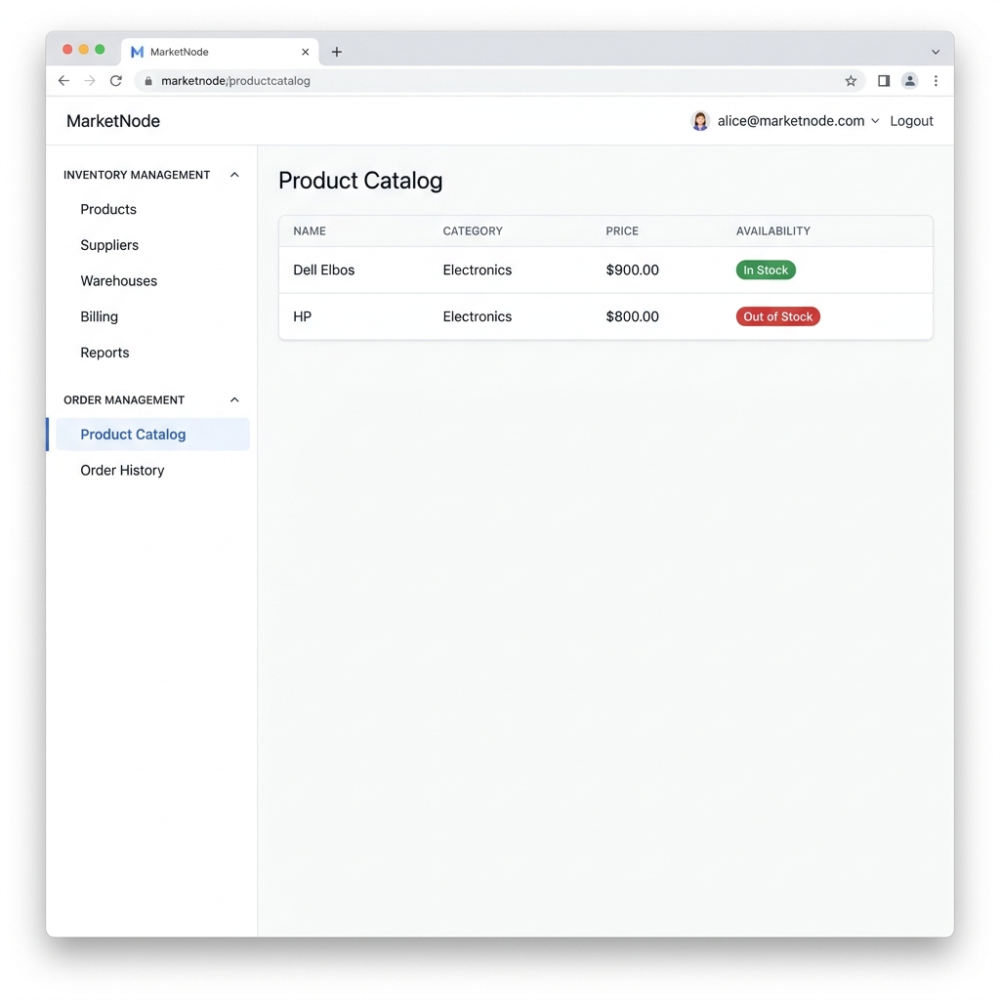
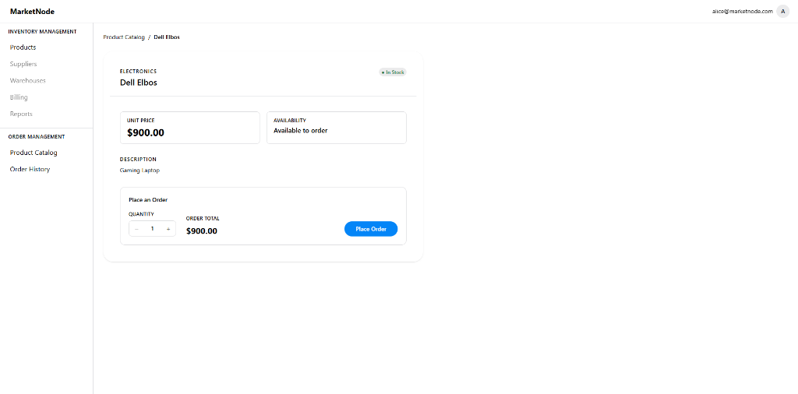
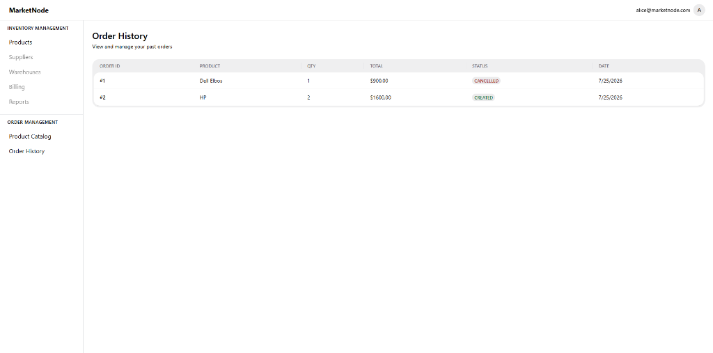
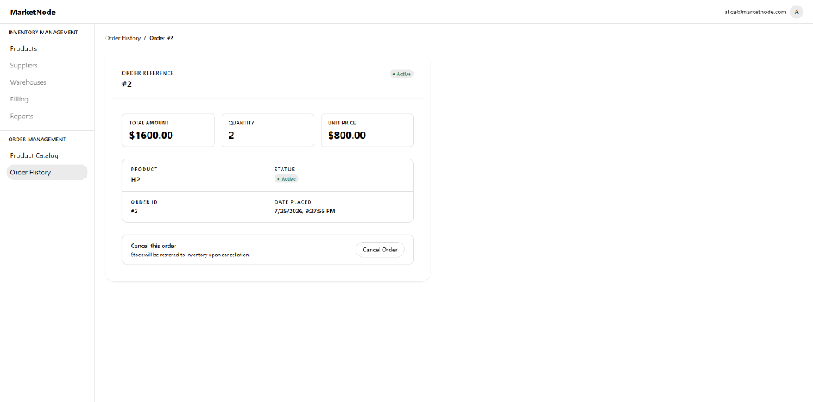

# MarketNode - Inventory & Order Management System

MarketNode is a unified platform comprising two core modules that share a product catalog and database:
1. **Inventory Management System (IMS)** — Internal tool used by staff to manage product catalog, pricing, and stock.
2. **Order Management System (OMS)** — Customer-facing storefront to browse products, view availability, place orders, and manage order history.

---

## 🚀 Quick Start Guide

Follow these simple steps to run the application locally:

### 1. Clone the Repository
```bash
git clone https://github.com/ritikporwal710/marketnode-order-management-system
cd marketnode-order-management-system
```

### 2. Build Docker Containers
```bash
docker-compose build    or docker compose build
```

### 3. Start the Application
```bash
docker-compose up -d    or docker compose up -d
```

Once started, access the application in your browser:
- **Frontend App**: [http://localhost:5173](http://localhost:5173)
- **Backend API**: [http://localhost:8080](http://localhost:8080)

---

## 📱 Order Management System (OMS) Screenshots

### 1. Product Catalog
Browse available products with clear stock availability indicators.



### 2. Product Detail & Order Placement
View product details, select quantity, calculate totals, and place an order.



### 3. Order History
View past orders with real-time status tracking (`CREATED` / `CANCELLED`).



### 4. Order Detail & Cancellation
Inspect detailed order breakdown and option to cancel active orders with automatic stock restoration.


